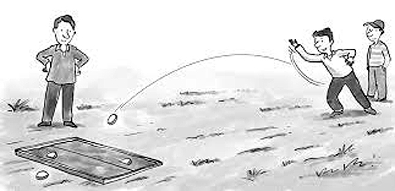
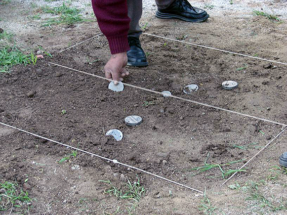

```{r setup, include=FALSE}
knitr::opts_chunk$set(echo = TRUE, fig.align="center")
```


# El tejo o la Rayuela

## Introducción

En este escrito doy una primera aproximación al uso de R y conceptos para realizar modelos estadísticos. En esta oportunidad a través del **juego del tejo**

{height="40%" width="40%"}

En mi país, Chile, es un juego común (supuestamente) en el ambiente rural, y sobre todo en las fiestas nacionales, los "18 de septiembre". De hecho, tengo el recuerdo que con mi familia cuando niño, en Cabildo, hacian varios juegos tradicionales, y entre estos tenían que preparar el terreno de juego para el tejo. Aunque acá en Chile, tambien le dicen **"La Rayuela"**, pero en otros países lationaméricanos le dicen la Rayuela a lo que nosotros le decimos **"El Luche"**. Bueno, todo un enredo, que no vamos a profundizar.

{height="40%" width="40%"}

De acuerdo, a lo que encontré en [internet](http://www.revistachilena.com/La_Rayuela.html), el cajon de juego es de 120 cm largo y 120 ancho y la linea donde debe caer el tejo para marcar una "quemada" y obtener **2 puntos** está a 60 cm horizontalmente en el cajon, de lado a lado. Tambien, está la opción de marcar **1 punto** si nadie acertó pero fuiste el más cercano a la linea.

Basado en los elementos anteriores me propongo en esta ocasión a explicar cómo: 

+ Crear una base de datos basados en un situación concreta donde han sido  registrados una series de **valores**, los puntos en un juego de reglas sencillas.
+ Gráficar los datos y ajustar los parametros visuales
+ Modificar esa base de datos (transformar y crear **variables** nuevas) para crear un gráfico que permita representar todas las variables.
+ Comparar distintas maneras de resumir los aciertos y errores, de acuerdo con las reglas del juego

Recomiendo ir copiando los trozos de codigo que acá aparecen e ir probando que te vayas llegando a los mismos resultados. Al empezar no es necesario entender que quiere cada elemento del codigo pero si ir intentando familiarizandote con la estructura o ciertos elementos que se repiten. Despues de todo es otro lenguaje más, pero que en esto caso nos permite comunciarnos con el computador y pedirle que haga cosas por nosotros. 


## Desarrollo 

### Primer Paso: Registro de los datos


Vamos a empezar con algo bastante simple, los registros que podríamos haber anotado manualmente en una hoja de papel en una partida de este juego..

En este escenario tenemos dos jugadores que tiraron tres veces cada uno,
el arbitro, luego de cada lanzamiento media con una regla la distancia en que caía el tejo, contando desde el comienzo del cajon.

Entonces, en su libreta de notas él indicó que:

jugador 1 =  60, 80, 40

jugador 2 =  70, 65, 55

Escribirlo en el lenguaje de R, sería de la siguiente forma: 

```{r}
j1 <- c(60, 80, 40)
j2 <- c(70, 65, 55)
```

Lo transformo ahora en un **data frame**, para que nos quedé listo para trabajar más adelante. Digamos que en una forma tabulada, como en una planilla excel, o un viejo 
cuaderno de matematicas con lineas verticales y horizontales. 


```{r}
puntos <- data.frame(rbind(j1,j2))
```

Le ponemos nombre a las variables, para recordar qué es qué

```{r}
colnames(puntos) <- c("intento1", "intento2", "intento3")
```

Ahora creo una variable para distinguir a los jugadores, y activo previamente el paquete (dplyr) necesario para que funcione la siguiente línea de código

```{r message=FALSE}
library(dplyr) 
puntos <- puntos %>% 
  mutate(jugador = rownames(puntos))
print(puntos)
```

### Segundo Paso: Gráficos

Graficámos los resultados del primer intento
           
```{r message=FALSE}

library(ggplot2) 
ggplot(puntos, aes(jugador, intento1, color = jugador)) +
  geom_point(size = 8) + 
  geom_hline(yintercept =  60, color = "green", linetype = "dotted", 
             size = 3, alpha = 0.5) +
  scale_y_continuous(limits = c(0,120),  breaks = c(0,30,60, 90, 120))+
  theme_classic() +
  theme( axis.text.x = element_blank(),
         axis.title.y = element_blank(),
         axis.text.y = element_blank(),
         axis.title.x = element_blank()
  ) 
  
```
 Algunas explicaciones del codigo anterior: 
 
 *geom_hline()* es para crear  la linea horizontal con la que se gana si el tejo cae justo encima.
 *scale_y_continuous()* 
 *theme_classic()*
 *theme()* son para limpiar el gráfico y solo queden elementos principales y se parezca lo máximo posible a un cajón. 


Continuo. Tengo que ajustar la base de datos si queremos poder graficar todos los intentos en un gráfico

```{r message=FALSE}
library(tidyr)
puntos <- puntos %>% 
  pivot_longer(cols = -jugador, names_to = "intento", names_prefix = "intento",
               values_to = "distancia")
```

Graficar todo el juego completo

```{r}
ggplot(puntos, aes(jugador, distancia, shape = intento, color = jugador)) +
  geom_point(size = 8, alpha = 0.7) +
  geom_hline(yintercept =  60, color = "green", linetype = "dotted", 
             size = 3, alpha = 0.5) +
  scale_y_continuous(limits = c(0,120), breaks = c(0,30,60, 90, 120))+
  theme_classic() +
  theme(axis.text.x = element_blank(),
        axis.title.x = element_blank(),
        axis.title.y = element_blank()
  )
```


### Definiendo los aciertos y errores

Calculamos la **diferencia** entre donde cayó el tejo y la linea objetivo

```{r}
puntos <- puntos %>% 
  mutate(diferencia = distancia - 60) 
print(puntos)
```

Graficamos ahora con esta nueva variable, usandola como una etiqueta.

```{r}
ggplot(puntos, aes(jugador, distancia, shape = intento, color = jugador)) +
  geom_point(size = 8, alpha = 0.7) +
  geom_text(aes(label = diferencia), position = position_nudge(x=0.1))+
  #anotamos con esta nueva linea la diferencia en el grafico
  geom_hline(yintercept =  60, color = "green", linetype = "dotted", 
             size = 3, alpha = 0.5) +
  scale_y_continuous(limits = c(0,120), breaks = c(0,30,60, 90, 120))+
  theme_classic() +
  theme(axis.text.x = element_blank(),
        axis.title.x = element_blank(),
        axis.title.y = element_blank()
  )
```

calculemos el desempeño **promedio** de cada jugador

```{r}
puntos <- puntos %>% 
  group_by(jugador) %>%  #primero agrupar datos por jugador
  mutate(promedio_jugador = mean(distancia))
print(puntos)
```

Si vemos los resultados, en promedio el jugador 1 cayó en lugar de la linea, es decir es el ganador. Pero otra manera de resumir el desempeño general es promediando cuanto se equivocó

```{r}
puntos <- puntos %>% 
  group_by(jugador) %>%  #primero agrupar datos por jugador
  mutate(promedio_diferencia = mean(diferencia)) %>% 
  mutate(promedio_diferencia_absoluta = sqrt(mean(diferencia^2))) 
#en la última linea, se elevó la diferencia al cruadrado para dejarlo en una medida #absoluta del error de cada jugador con ^2 y luego se volvió a la medida original
#usando sqrt(), esto es,  la raiz cuadrada
print(puntos)
```

Lo interesante de este resultado, es que si bien en promedio de la distancia donde cayó su tejo, lo hizo mejor el jugador 1, si revisamos las diferencias absolutas, el jugador 2 lo hizo mejor, a la larga se equivocó menos, pesé a que nunca le atinó exactamente. , mientras que el uno, en el promedio simple lo hizo mejor ya que lo que se equivocó pasandose en su primer intento, se es escondé al promediarlo con lo mucho que le faltó en su tercer lanzamiento

## Los Aciertos

Luego, podemos tambien crear una nueva variable **dictomica** que define si el intento acertó o no.

```{r}
puntos <- puntos %>% 
mutate(resultado = ifelse(diferencia  == 0, "Acierto", "Fallo"))
#entonces, si la diferencia es 0, significá que acertó. Cualquier otro numero será
#un fallo. 
#Y entonces hacemos un tabla para resumir los resultados
table(puntos$resultado, puntos$jugador)
```

Teniendo el dato de aciertos fallos podríamos hacer una nueva variable que sea la proporción de aciertos en relación al total de lanzamientos

```{r}
puntos <- puntos %>% 
  group_by(jugador) %>% 
  summarise(prop.aciertos = mean(resultado == "Acierto"), 
            promedio_diferencia_absoluta = max(promedio_diferencia_absoluta)) 

```

Cómo podemos ver la proporciones de aciertos en el jugador 1 es del 0.333, mientras que en el dos es 0.

Ahora, para terminar, grafiquemos la proporción de aciertos con el promediod de las diferencias absolutas de sus lanzamientos 

```{r}
ggplot(puntos, aes(prop.aciertos, promedio_diferencia_absoluta, color = jugador))+
  geom_point(size = 8)
```


Ahora solo nos faltaría conseguir datos de más jugador y partidas, y replicar todo esos codigos sobre nuestro nuevos datos y podríamos ver si en este último gráfico encontramos algún tipo de relación.

## Reflexiones Finales

* ¿Que es mejor para evaluar los rendimientos entonces? 
+ ¿Los promedios?
- ¿Los promedios de los errores?
- ¿Los promedios de los errores absolutos?
+ ¿Aciertos vs fallos?

La respuesta para nada sorprendente a todas estas preguntas es **"depende"**
una palabra muy usada tanto por la estadística como por la psicología, porque básicamente es muy dificil encontrar algo que no se influenciado o causado por otra cosa. El contexto es sumamente importante para poder tomer una decisión. 
Seguiré con esto en proximo entregas, para que podamos entender cuando es mejor usar cada cosa.


# Conceptos epidemiológicos

## Morbilidad

### **Tasa de ataque**

Se define como: a/b, donde

-   a es "N° en riesgo en las que se produce X enfermedad"

-   b es "N° total en riesgo

*Ejemplo*:

100 personas enfermaron al comer X alimento 200 personas comieron X alimento.

```{r}


a <- 100

b <- 200

#creamos la función de la tasa

tasa_de_ataque <- function(a, b){
  a/b
  }

#Aplicamos la función. 

tasa_de_ataque(a, b)
```

### **Tasa de Incidencia**[^1]

[^1]: **Diferencia entre tasa de ataque y de incidencia:** La tasa de ataque se considera una proporción. En esta no hay expecifiación de **cuándo** sucedio, a diferencia de la incidencia, donde el tiempo es un factor clave.

Es una medida de riesgo porque involucra una transición y tiempo

Se define como a/b, donde

-   "a" es n° de casos *NUEVOS* de X enfermedad en un población y tiempo especifico.

-   "b" es n° de casos en riesgo de X enfermedad en un población y tiempo especifico

Nota: los casos en riesgo son los que efectivamente puedan llegar a tener la enfermedad. Si no se tiene utero no se puede tener cancer uterino.

*Ejemplo*:

5 adultos fueron diagnosticados con esquizofrenia, de 25 que habían sido evaluados en la adolescencia Ocon riesgo a tener ese mismo trastorno.

```{r}


a <- 5

b <- 25

#Creamos la función de la tasa (esta se remplazará a la que teníamos hecha anteriromente)

tasa_de_incidencia <- function(a, b){
  a/b
  }

tasa_de_incidencia(a, b)

```

### **Prevalencia**

Se define como a / b, donde

-   "a" es N° de personas que presentan X enfermedad en un momento determinado

-   "b" el total de personas en ese mismo momento

Acá no ocupamos la palabra Tasa, ya que no hay una transición, la formula con considera un cambio de estado de sano a enfermo.

*Ejemplo*:

120 estudiantes de primer año presentaron algun trastorno ansioso , de un total 1000 estudiantes nuevos

```{r}
a <- 120

b <- 1000

Prevalencia <- function(a, b){
  a/b
  }

Prevalencia(a, b)

```

### Relación entre Incidencia y Prevalencia

Según lo visto anteriormente, la incidencia sería adecuada usarla en estudios con diseño longitudinal y la prevalencia en estudios transversales. Además, podemos notar que están relacionadas y que además tenemos que considerar las muertes y recuperaciones en esa relación.

Por ejemplo, partimos con 100 casos enfermos de una población total de 1000 (todos suceptibles). Y tenemos la información que la incidencia que la incidencia es de 0.5

Nos quedan 900 casos que podrían potencialmente enfermar.

Si la tasa de incidencia es = a/b y tenemos que

0.5 = a/900

900 \* 0.5 = a

```{r}

a <- 900 * 0.5

a
```

Entonces van a ver 450 casos nuevos, y podríamos a volver a calcular una nueva prevalencia actualizada con esa información.

```{r}

prevalencia_1 <- 100/1000

prevalencia_2 <- (100 + 450) / 1000 
 
  # los casos del primer momento + los casos nuevos / la población total que sigue igual


prevalencia_1
prevalencia_2


(prev_cambio <- prevalencia_2 - prevalencia_1)

```

En el recuadro anterior comenté que la población sigue igual ¿pero que pasa si hay mortalidad?

Hay pueden haber distintos escenarios, por ejemplo que mueran casos con la enfermedad o casos sanos. Eso hara variar nuestra prevalencia ¡aunque la incidencia se haya vuelto 0!

```{r}
#conservo objeto anterior

prevalencia_1

#pero ahora la prevalencia dos cambiara por cambio en la población total debido a mortalidad en esta de casos sanos.

(prevalencia_2 <- 100/900)

#o podemos pensar en el escenario que los 100 casos que murieron fueron los enfermos 

(prevalencia_3 <- 0/900)

library(dplyr)
library(ggplot2)

cambios <- data.frame(rbind(prevalencia_1, prevalencia_2, prevalencia_3))

colnames(cambios) <- "prevalencias"
                         
ggplot(cambios, aes(row.names(cambios), prevalencias))+
  geom_point(size = 8)


```

Como se observa acá, la prevalencia puede variar no solo por incidencia o recuperación, sino tambien por mortalidad. En otras palabras, como estos calculos son simples divisiones, cualquier cambio tanto en numerados o denominador afectará el resultado.


# RPG, por Rol y por R

## Comienza la aventura

Primero que todo hay que entender que en el mundo de la *magia* y lo oculto reina la **incerteza**. No es posible gobernarla totalmente y tenemos que estar preparados para lo **inesperado**.

Para entender esta idea, haremos un pequeño estudio de dos tipos de ataques básicos.

Como base crearemos un **objeto**: un dado de 6 caras


```{r}
d6 <- c(1,2,3,4, 5,6) 
```

Lanzar un dado de 6 caras

```{r}
sample(d6, 1)
```

Lanzar 3 dados de 6 caras

```{r}
sample(d6, 3)
```

Crear un Ataque de fuego

Donde x = nivel del ataque.

```{r}

ataque_fuego <- function(x){
  sample(d6, 1) * x
}
```

Un equipo de 3 atacando 1000 veces!


```{r}

stats.fire <- replicate(1000, ataque_fuego(1)+ ataque_fuego(1)
                   + ataque_fuego(1))
```

Crear un dado de 4 caras 

```{r}
d4 <- c(1,2,3,4) 
```

Crear un Ataque de rayos

```{r}
ataque_rayos <- function(x){
  sample(d4, 1) + 2 + x
}

```

Un equipo de 3 de rayo, 1000 veces!

```{r}
stats.ray <- replicate(1000, ataque_rayos(1)+ ataque_rayos(1)
                        + ataque_rayos(1))
```

Crear gráficos!


```{r}
hist(replicate(10, ataque_fuego(1)))

hist(replicate(100, ataque_fuego(1)))

hist(replicate(1000, ataque_fuego(1)))

hist(stats.fire)

```

## El secreto de cómo llamar y crear hechizos 

### Funciones y Hechizos

Ahora aprendamos una nueva función, o cómo yo prefiero llamarla frente a los no-iniciados, un *hechizo*

Con solo usar una palabra (comando), podremos tener información sobre cuál fue el ataque más fuerte hecho por el equipo de fuego

```{r}
max(stats.fire)
```
Veamos ahora cuál fue el del equipo de rayos

```{r}
max(stats.ray)
```

Parece ser más poderoso el equipo de rayos. ¿Quieres pertenecer a él?

Digamos que queremos saber la diferencia entre los ataques más fuertes, pero nos da pereza usar una calculadora. Podemos usar la magia de R nuevamente

```{r}
max(stats.fire)-max(stats.ray)
```
Listo!. Fue tan simple como eso

Pero ordenemos las cosas. No queremos tener los registros desparramados por ahí, así que mejor creamos algo semejante a lo que genera un tipo de magia primitiva pero aun muy usada llamada *excel* (trataremos de no volver a mencionar ese nombre por aquí)

Usaremos una nueva funcion : data.frame, y en esta incluiremos nuestros objetos que reunen la información de los ataques hechos por ambos equipos


```{r}
stats <- data.frame(stats.fire,stats.ray)
```

Revisemos la estructura de este nuevo objeto creado (sí, estaremos creando muchos objetos)

```{r}
str(stats)
```
Dice que tenemos 1000 observaciones. Eso es verdad, cada equipo atacó mil veces (son muy decididos), y además dice que tenemos 2 variables, es cierto, cada uno de los objetos, vectores, que creamos anteriormente, pasaron a ser una de las variable. Cada variable pasa a ser una columna en nuestra data.frama

Veamos que tipo de variable son:

```{r}
class(stats.fire)
class(stats.ray)
```

Ambos son "numeric", es decir numericos, en inglés (lamentablemente gran parte de la magia R y su documentación esta en inglés, pero acá estoy escribiendo esto para ayudarte, quiero que te cueste mucho menos que a mí).

También podíamos saber que eran numéricos porque cuando revisamos la estructura de nuestro data frame despues del nombre de cada variable aparecia "num", la abreviación para numérico. 


¿Y para que rayos nos sirve saber que es númerico? bueno para aplicar una función que sea para esa clase. ¿O caso intentas usar un hechizo contra dragones sobre una mandragorá? ¡Por su puesto que no funcionará! o en el peor de los casos creará una monstruosidad. 

```{r}
mean(stats.fire)
mean(stats.ray)
```
Con esto acabamos de calcular la media aritmética de cada variable. Simplemente escribimos en la consola mean() y dentro de los parentesis las variable que queremos aplicar esta función. 

Si queremos saber la diferencia entre las medias, hacemos lo mismo que cuando usamos la función max() 

```{r}
mean(stats.fire)-mean(stats.ray)
```

*(te empezarás a dar cuenta que la técnica ancestral del copy-paste va a ser tu gran aliada en este mundo. ¡ctrl c + ctrl v es amor! )*


### Un invitado impertinente

-Lo siento, no tengo tiempo para escribir cada función por cada estadístico descriptivo. ¡Me aburro! - 

¿ Y tu quién  o qué eres?

-soy tu compañero de aventura, tu ayudante, tu fiel escudero-

A disculpa no lo había notado. Eres algo pequeño.

-Puede ser, pero soy un terrible demonio-

Ah sí? ¿y cuál es tu nombre?

-Bythe - 

De acuerdo Bythe, no tengo problemas en enseñarte. Pero debes saber que no será un camino fácil. 

-sí, sí, deja tus oraciones y dime el poder secreto para obtener todos mis estadisticos fácilmente-

De acuerdo, eso se llama summary(), lo usamos igual que cuando usamos las **palabras mágicas ** max() y mean() 

```{r}
summary(stats)
```

-¡Oh sí! De este poder estaba hablando-


Hablando de poder, veamos cómo podemos definir el poder. Y en el futuro predecir el poder de nuestros oponentes según alguna de sus caracteristicas. 

Por ejemplo:

una idea sencilla de esto podría ser que el poder **depende** de la condición fisica, que tan entrenado fisicamente está nuestro énemigo. 

poder = c.fisica 

```{r}
c.fisica <- 4
poder = c.fisica

poder

```

Como estamos diciendo que el poder equivale a la c.fisica, entonces no hay diferencia entre ambas variables

```{r}
poder - c.fisica
```


Ahora crearemos **100** goblins con distintos niveles de poder. Asumiendo que está se distribuye de forma normal, con una media **6** y desviación estándar de **2**

```{r}

c.fisica <- rnorm(100, 6, 2)
c.fisica

```

Para hacer lo anterior, usamos la función **"rnorm"**, estas nos deja crear muestras con una distribución normal, le damos el tamaño, el promedio y la desviación. En ese mismo orden. 

si no nos gustan los decimales podemos redondear los números. Con la función round() 

```{r}
round(c.fisica)
```

Conjuremos un histograma para ver que tan normal se ve.

```{r}
hist(c.fisica)
```

Vamos ahora a complejizar nuestra definicion de poder. Ahora tambien considerará el tamaño de los goblins, por que no dará lo mismo la condición fisica si este es grande o pequeña, claramente podrá usar una arma más grande y peligrosa, quizas pierda sigilo, pero eso ya es para otra historia. 


```{r}
tamaño <- rnorm(100,60, 30)
tamaño
hist(tamaño)
```

y entonces el paso final...

```{r}
poder = tamaño + c.fisica
hist(poder)

```

Probemos con otro tipo de grafico, para poder visualizar la relación entre el poder y las caracteristicas fisicas mencionadas.

```{r}
scatter.smooth(c.fisica,poder)
scatter.smooth(tamaño,poder)
```
-Esto no me hace sentido. yo esperaba que a mejor c.fisica, más poder.¡Farsante!-

Tienes razón. Esto es porque las variables no están estandarizadas.
la variable tamaño tiene mucho más "peso" en nuestro modelo, por que los numeros son más grandes, poder ende representan un mayor porcentaje a la hora de crear la variable poder. Si queremos equipararla y compararlas en las mismas condiciones, necesitamos usar la funcion "scale"


```{r}
std.c.fisica <- scale(c.fisica)
std.tamaño <- scale(tamaño)
std.poder = std.tamaño + std.c.fisica

scatter.smooth(std.c.fisica, std.poder)
scatter.smooth(std.tamaño, std.poder)
```

0 representa quienes tienen una condición fisica promedio, y tamaño promedio. El dos cuántas desviaciones estandar se alejan de esto. 
Es decir, a más grande sea el tamaño y y mejor sea la condición fisica del goblin, más poder tendrá comparado con el goblin promedio. 

                            **... Continuará...**


